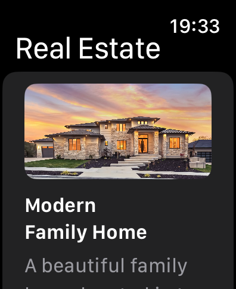
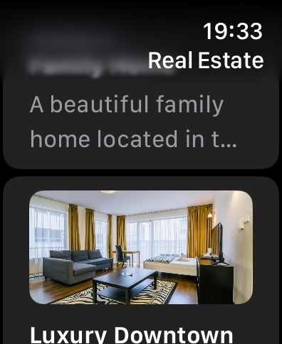
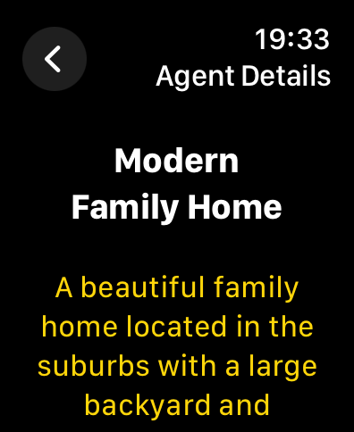
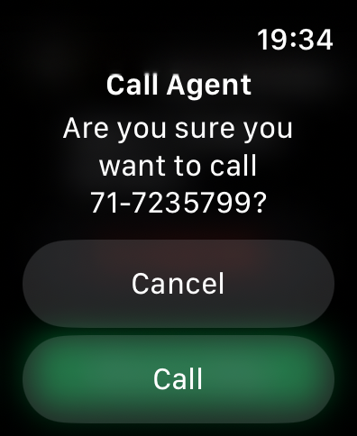
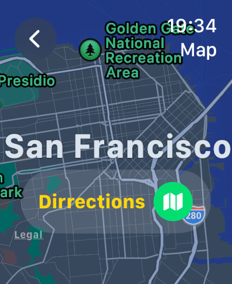
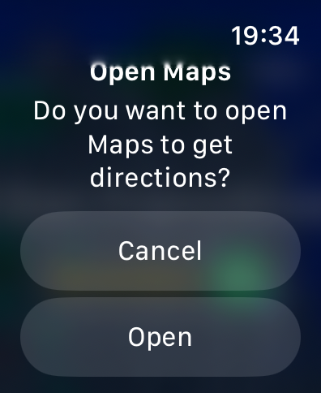

# RealEstate Market Watch App

## Student Information
**Student ID:** IT21070358  
**Student Name:** Thihan D.P.D

## 01. Brief Description of Project
RealEstate Market Watch App is a ios watch application designed to facilitate real estate browsing, connecting users with agents, and navigating to property locations. It offers a comprehensive platform for users to explore available properties, view details, contact agents, and visualize property locations on a map.

## 02. Users of the System
- Individuals searching for real estate properties to buy or rent.
- Real estate agents looking to showcase their listings and connect with potential buyers or renters.

## 03. What is unique about my solution
RealEstate Market Watch App distinguishes itself by offering a seamless user experience with its intuitive interface and robust features. It provides a convenient way for users to browse through property listings, view detailed information, and directly contact agents. The integration of map functionalities allows users to visualize property locations and obtain directions easily.

## 04. Screens and Functionality

### Screen 1: RealEstateListView
Description: Displays a list of real estate properties with images, titles, and descriptions. Users can tap on a property to view more details.

### Screen 2: RealEstateAgentView
Description: Shows detailed information about a real estate agent, including their contact number. Users can tap on the contact number to initiate a call.

### Screen 3: RealEstateMapView
Description: Displays a map view with pins indicating the locations of real estate properties. Users can tap on a pin to view more details or get directions.

| Home Screen | Home Scroll | Detail Properties |
|-------------|-------------|------------------------|
|  |  |  |
| Detail Properties Scroll | Contact Agent | Map View |
|  |  |  |
| Get Dirrections on map |  |  |
|  

## 05. Documentation 

### (a) Design Choices
The application is built using SwiftUI for the user interface and MapKit for map functionalities. SwiftUI offers a declarative approach to building user interfaces, making it easier to create dynamic and responsive layouts. MapKit provides built-in support for displaying maps and annotations, allowing for seamless integration of map views into the application.

### (b) Why would someone want to invest in my project idea
RealEstate Market Watch App offers a convenient and user-friendly platform for individuals interested in the real estate sector. Investors may find value in the application's comprehensive features, including property listings, agent contacts, and map navigation. The application has the potential to streamline the real estate buying process and enhance user experience.

### (c) Further enhancements proposed
1. Implement user authentication and personalized user profiles.
2. Add support for filtering and sorting property listings based on various criteria such as price, location, and amenities.
3. Incorporate augmented reality (AR) features for viewing properties in a real-world environment.
4. Integrate a messaging system for communication between users and real estate agents.
5. Enhance the map view with additional features such as route planning and traffic information.

### (d) How I would commercialize this product
The application can be commercialized through various monetization strategies, including:
1. Subscription-based model: Offer premium features and content to subscribers for a monthly or annual fee.
2. In-app advertising: Partner with real estate agencies and related businesses to display targeted advertisements within the app.
3. Transaction fees: Charge a commission or transaction fee for property sales or rentals facilitated through the app.
4. Freemium model: Provide basic features for free and offer premium upgrades for advanced functionalities.

## 06. Reflection

Challenges Faced:
- Implementing complex UI layouts and interactions using SwiftUI.
- Integrating MapKit functionalities, such as geocoding and map annotations.
- Testing and debugging on watchOS devices due to limited debugging capabilities.

Alternative Approaches:
- Utilizing third-party libraries or frameworks for certain functionalities to simplify development.
- Breaking down the project into smaller, more manageable tasks to address challenges incrementally.
